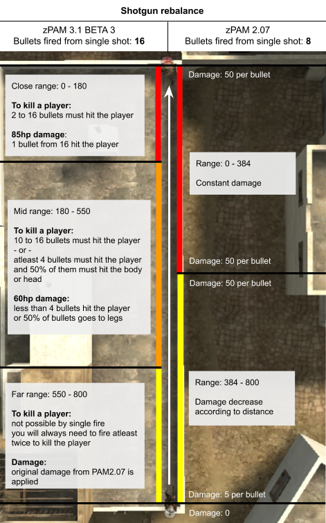
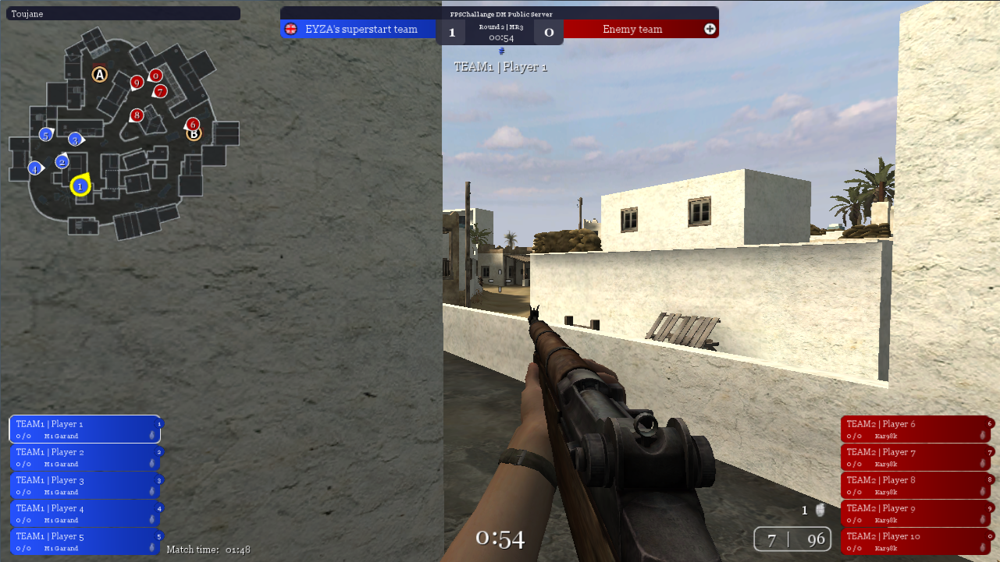

# Introduction

Mod zPAM4.00 is a competitive mod for CoD2. <br>

The code from the previous version zPAM 2.07 was completely rewritten and ported to a new code base, which helped in the implementation of new features and bug fixes.

Work on this PAM was initiated by me in 2015 and was never fully finished. On corona days, I decided to finish it.

❗ Note ❗ <br>
*This page describe only actual version zPAM 4.00.<br>
To see description of previous versions, click on the links in [Version list](#version-list).*

## Download
- #### Actual testing version
	- 2025/09/21 - <b><a href="https://github.com/eyza-cod2/zpam3/releases/download/4.00-test1/zpam400_test2.zip">zPAM 4.00 - zpam400_test2.zip</a></b> - compatible with **CoD2x >=1.4.5.x** only

- #### Actual stable version
	- 2025/09/15 - <b><a href="https://github.com/eyza-cod2/zpam3/releases/download/3.36/zpam336.zip">zPAM 3.36 - zpam336.zip</a></b> - compatible with CoD2 1.0, 1.2 and 1.3

## Version list
- 2025/09/21 - <b>zPAM 4.00 TEST 2 • CoD2x</b>
- 2025/09/20 - <b>zPAM 4.00 TEST 1 • CoD2x</b>
- 2025/09/15 - <b><a href="https://github.com/eyza-cod2/zpam3/tree/0ed8a460cddaffb7de0c1b54ce115c4c8dcdcbe6">zPAM 3.36</a></b>
- 2025/09/02 - <b><a href="https://github.com/eyza-cod2/zpam3/tree/2f22c5afbe6ba1a471e9a2cbbd98eee2025cd1de">zPAM 3.35</a></b>
- 2024/08/25 - <b><a href="https://github.com/eyza-cod2/zpam3/tree/e73c0fd786781238b6ee5f3e1b81580da84cbf76">zPAM 3.34</a></b>
- 2023/08/30 - <b><a href="https://github.com/eyza-cod2/zpam3/tree/abbc16d244a820aa08372d4238cb53062f90ced0">zPAM 3.33</a></b>
- 2022/02/24 - <b><a href="https://github.com/eyza-cod2/zpam3/tree/c29866e22a6bcfd739515006e465062ec5a9e1f7">zPAM 3.32 PREVIEW</a></b>
- 2022/10/13 - <b><a href="https://github.com/eyza-cod2/zpam3/tree/3239562802398e9eb16aecb09c8d03e6f902d7ce">zPAM 3.31 PREVIEW</a></b>
- 2022/10/07 - <b><a href="https://github.com/eyza-cod2/zpam3/tree/f254c512574269b4e37971f730087707417d3dce">zPAM 3.30 PREVIEW</a></b>
- 2021/07/15 - <b><a href="https://github.com/eyza-cod2/zpam3/tree/53e1a8e7243596c763e623318668438d8320b257">zPAM 3.22</a></b>
- 2021/05/16 - <b><a href="https://github.com/eyza-cod2/zpam3/tree/f0bea94f83791c4a756909963101bfd9d340757f">zPAM 3.21</a></b>
- 2021/05/05 - <b><a href="https://github.com/eyza-cod2/zpam3/tree/c7d5fa259e6e21a7fc510847421fab5338f19d0d">zPAM 3.20</a></b>
- 2021/01/05 - <b><a href="https://github.com/eyza-cod2/zpam3/tree/a365aa9d884f87a368e51879b016157b431ee449">zPAM 3.1 BETA 6</a></b></b>
- 2020/11/29 - <b><a href="https://github.com/eyza-cod2/zpam3/tree/b3e8711b13b493134ec1c762aeba17399eefb95d">zPAM 3.1 BETA 5</a></b></b>
- 2020/09/24 - <b><a href="https://github.com/eyza-cod2/zpam3/tree/2d3e3589dced881409bd42d2c5c500cc6ed3e0a1">zPAM 3.1 BETA 4</a></b></b>
- 2020/05/13 - <b><a href="https://github.com/eyza-cod2/zpam3/tree/c327385fd7cc7fbcb1d3d04a443abf16ee93ad6b">zPAM 3.1 BETA 3</a></b></b>
- 2020/04/28 - <b><a href="https://github.com/eyza-cod2/zpam3/tree/8c9e528ad09be3ce626bcd36463c3cdf180295ae">zPAM 3.1 BETA 2</a></b></b>
- 2020/04/23 - <b><a href="https://github.com/eyza-cod2/zpam3/tree/f58fdedbf23f31c62e29ffd25379d6a1d7993e49">zPAM 3.1 BETA</a></b></b>


## Changelog

<details><summary>zPAM 4.00 TEST 1 changes (click to open)</summary>
<p>

**Changes / Fixes / Improvements:**
- Faster loading of objectives on round start on compass
- New functions for developer
- Clock in strat always visible (0:00)
- Added objective icons (plant labels) in strat
- Fixed double-hit sound via nade, added double-cross hit icon when 2 or more player are hit
- Added warning about unsupported game version (1.0, 1.2, 1.3 and old CoD2x versions)
- Added sv_cracked to be monitor for changes
- Added scr_posters into ignored cvars + prevent restart when match system is activated
- New streamer layout (CoD2x)
- Match system support (CoD2x)
- Competitive settings (limits of max fps, wait command,etc) (CoD2x)
- Flag for first time player connects
- Added CodeCallback_StopGameType (CoD2x)
- Added support for sv_fps 40 (introduced in CoD2x)
- Improved text when player call pistol bash
- Fixed weapon count cvars for nades and smokes, used in custom settings for public servers
</p>
</details>


<details><summary>zPAM 3.36 changes (click to open)</summary>
<p>

**Changes / Fixes / Improvements:**
- new mappack version 6
  - updated maps: mp_railyard_mjr, mp_leningrad_mjr
- detection of CoD2x
</p>
</details>


<details><summary>zPAM 3.35 changes (click to open)</summary>
<p>

**Changes / Fixes / Improvements:**
- new mappack version 5
  - new maps: mp_railyard_mjr, mp_leningrad_mjr
  - removed killtriggers on mp_trainstation_fix (Caen)
- requirement to rename zzz_zpam_custom.iwd to something unique (e.g. zzz_zpam_custom_fpschallange_v1.iwd).
- adjusted text of zPAM installation error message
</p>
</details>


<details><summary>zPAM 3.34 changes (click to open)</summary>
<p>

**Changes / Fixes / Improvements:**
- new mappack version 4 (new maps: mp_leningrad_tls, mp_trainstation_fix, mp_vallente_fix, mp_dawnville_sun, mp_crossroads, mp_carentan_bal)
- bug fix - SCOPE / SHOTGUN not pickable in strattime when dropped
- new button in weapon menu: "Replace secondary with pistol" - fixes an issue when you click again on the currently selected weapon and the secondary weapon is removed
- weapon menu fix - when "[ESC] Close" button is clicked, menu does not close properly and only cursor stays visible
- adjusted streamer layout (team scores and names moved next to player bars; match time and score from previous maps moved next to compass; round info moved next to time; made sure that compass has always the same size, lagometer is hidden, fps is hidden)
- feature to save server data into file (match info, player positions, score, health), could be used as API
- russians are enabled by default on winter maps
- feature to show posters on walls (for lans)
- new weapon FG42 (disabled by default)
- balanced BAR - damage increased from 40 to 45 (disabled by default)
- removed PCW mode, replaced with custom mode, which can be adjusted for specific needs (nightcups, lans, ...)
- fixed false grenade hit indication when enemy is killed by other player in the same moment
</p>
</details>


<details><summary>zPAM 3.33 changes (click to open)</summary>
<p>

**News:**
- [3.3.72] New streamer team for auto-spectator features
    - Is completly rewrited, new method for mouse and key detection
    - Hotkeys to toggle Auto-spectator, replay kill, toggle XRAY, toggle showing hit values, follow player
    - Auto-killcams will be played at the end of the round even if auto-spectator is off
    - If the killcam is too long, the round end timer will be extended
    - Auto-spectator will predict player positions to improve switching to players in right situations
    - XRAY will be turned off by default
    - Player's left and right boxes are now not sorted by score, but now by client number (for easier hotkeys)
    - Player's left and right boxes now contains info about weapons (similar to CSGO)
    - Spectators are automatically set ready-up
    - Score progress now indicate who called the timeout with via team color
    - Player progress will be colored via team color to better indicate the players count situations
    - Added kill count for individual players in current round
    - Adjusted the font size of XRAY - now it will dynamically change the size based on distance
    - Text who is planting / defusing the bomb
    - 2 color modes - blue and red, cyan and purple
- [3.3.73] Plant - added timer showing time left to explosion; when bomb is defused, it will show the remaining time till explosion
- [3.3.74] In the strat-time period, a new "weapon drop" sound is played when you drop your secondary weapon (helps people easily detect where you drop your weapon)<br>
- [3.3.75] Clearing the console after auto-recording started on each map (to avoid the need to scroll down the console)
- [3.3.76] Aim-trainer on FIX maps available in readyup (https://youtu.be/XmURNWF3bHs)
- [3.3.77] Updating of the scoreboard every round to have it available when replaying demos (scoreboard is by default updated only when is opened by player)
- [3.3.78] Added empty name protection - if empty name is used for first time, player is warned and renamed. The second time player is kicked.
- [3.3.79] LOD models - forcing tanks, cars, trucks, and artillery flak to be always rendered at high detail (this fixes holes in models at long distances)

**Fixes / Improvements:**
- Readyup: fixed "welcoming" text that were not showing when you joined team + added info about time to readyup (halftime 2min, timeout 2min, between maps 5min)
- Scoreboard menu: possibility to set players color from menu also in readyup
- Overtime: score is not reset in overtime now; when map ends up with 12/12 score, the end score limit is just increased by 4
- Grenade "eater" bug fixed - when you pickup grenade from ground from enemy team, that grenade was not dropped when you die; now all grenades will be dropped
- Fixed clan team names - sometimes the last character was cutted off
- RCON kick player list was extended from 16 to 22 lines
- Strat: removed bot's icon above head
- Round report: hit to Body was renamed to Torso-lower and Torso-upper
- List of players left: fixed empty names
- Fixes for HQ and CTF server crashes
- Restoring to original smoke rendering
- Updated FIX maps, they will be named mp_toujane_fix mp_carentan_fix mp_dawnville_fix mp_matmata_fix mp_burgundy_fix
- Improved "hand hitbox fix" (fix was not applied when head point is behind cover + double shots bug fix)
- Improved "consistent shotgun" - distance between players is now more precisly counted between attacker's eye origin and enemy pelvis origin
- Adding the distance between you and the enemy for shotguners into round report
- Fixed team menu not opening when "russian" sub mode is used on russian maps (via rcon menu or via /rcon pam_mode comp_russian)
- Added more info into /pam_damage_debug to have better understanding why some of the hits occured
- Fixed swapped map score history in match info bar - score was sometimes swapped from player's view (Toujane 13:6 instead of Toujane 6:13)
- Fixed missing smoke for shotgun in CTF, HTF, TDM
- Improved team name generating
- STRAT gametype: added clock timer
- Fixed TDM halftime missing in time sub pam modes
- Fixed "&&1 Wins!" string in DM scoreboard
- Dawnville: fixed splash MG stuck bug when MG fix is applied
- DM gametype: restored DM objects + MG
- Weapon usage is now generated for each individual weapon, not by class
- Scope and shogun auto-drop protection when you pickup weapon from the ground was improved by disabling scope / shogun pickup when there are other players near by; pickup is allowed only when the player who owns the weapon is near by the weapon.


</p>
</details>


<details><summary>zPAM 3.32 changes (click to open)</summary>
<p>

- [3.3.70] Silent weapon switch when climbing - restoring the original behavior + disabling the weapon switch sound that is played only in 1st point of view
- [3.3.71] New hand hitbox fix - addressing the hit problems
- Fixed pistol being dropped in rifle mode when player is killed
- Fixed auto-recording in deathmatch
- Fixed RCON menu - rifle and 2v2 mode had wrong order, (correct comp_rifle_2v2 instead of bad comp_2v2_rifle)
- Auto-spectator improvements:
    - new XRAY icons besides player names showing enemies behind walls - all toggle able by holding F
    - fixed black screen for dead players if killcam is played
    - damage info moved down next to "You killed XXX" text
    - when there is more killcams to be played at the end of the round and end time elapsed, its extended so killcams are fully played (players will have disabled weapons in this period)
- Improved round report
    - showing damage for kills + fixed showing 0hp damage
    - red star is added indicating that "Hand hitbox fix" or "Torso hitbox fix" was applied
- Improved scoreboard
    - adding a button to take a screenshot of scoreboard with ENTER key (since binds are not working in new scoreboard)
    - it will always show disconnected players (with [-] prefix) for 5 mins (so you see stats for all players in final scorebard)
    - only Kills and Deaths will be showed for enemy team (to avoid recognize enemy position by watching the scoreboard)
    - added statistic of kills with grenade
    - hits counting changed: Scope/rifle +1,  Semi/Automatic/Shotgun +0.5    (its counted once after the hited player is fully healed)
    - hits colored yellow if its value is >=5.0 and red if its value is >=10.0
- Adding 10min settings for time based gametypes (DM, TDM, HQ, CTF, HTF)
- Added damage info into readyup (testing)
- Fixed scr_motd not being able to change
- Disabled killing with grenade in readyup
- Showing type of server and number of players slots in server info menu
- Some other minor changes
</p>
</details>


<details><summary>zPAM 3.31 changes (click to open)</summary>
<p>

- [3.3.68] Climbing sound fix
	- If you climb ladder or wall, the "weapon switch" sound was made only for 1st person player, it was silent for other players
	- Now the sound matches equally, so you hear exactly what other players hear (meaning if you climb ladder or wall, "weapon switch" sound is made for everybody)
	- If you want to silently climb ladder or wall, you need to hold weapon down by scrolling down 2x and hold left mouse
	- This fix replaces previous [3.3.49] "Ladder weapon fix" in 3.30
- New version of mappack - zpam_maps_v2.iwd
	- There is a problem with previous version zpam_maps_v1.iwd - when you have this file downloaded in main folder and you try to connect older 3.22 server, error "Impure client detected" shows
	- Please remove old zpam_maps_v1.iwd file from main folder
- [3.3.69] SD voiceover sound "Move in!" is now played only if player is not moving (replaces [3.3.62])
- Verson 1.0 will not require to have mappack zpam_maps_v2.iwd installed because there is no possibility for fast download
- Autospectator fixes
- UI stuff minor changes
- HTF flag spawn timer fix when timeout

</p>
</details>


<details><summary>zPAM 3.30 changes (click to open)</summary>
<p>

#### News:
- [3.4.16] New pam mode names - cg was removed, now only pub and comp modes are available with sub modes.
	- modes: pub, comp, warmup
	- sub-modes: 2v2, rifle, russian, lan, custom
	- Examples:
		- /rcon pam_mode pub  			- Public mode (custom settings)
		- /rcon pam_mode comp  			- Competitive mode
		- /rcon pam_mode comp_mr3  		- Competitive mode with max round 4
		- /rcon pam_mode comp_custom   		- Competitive mode for team mix
		- /rcon pam_mode comp_custom_russian 	- Competitive mode for team mix, russian side on russian maps
		- /rcon pam_mode comp_2v2 		- Competitive mode, scope and shotgun disabled
		- /rcon pam_mode comp_rifle 		- Competitive mode, bolt action and sniper only
		- /rcon pam_mode comp_rifle_2v2		- Competitive mode, bolt action only, sniper disabled
		- /rcon pam_mode comp_lan  		- Competitive mode on LAN, no readyup time limits
- [3.4.17] Added support of HQ, CTF, HTF and RE gametypes
- [3.4.18] Added rifle only mode
- [3.3.44] Cvar system rewrited; any change to server settings is retained even when map changes; new cvar /pam_mode_custom is defined - it tells that changes made to server settings stays between map
- [3.3.45] Warnings about wrong server settings (no password, cheats enabled, punkbuster disabled, cvars changes) is changed; its showed in left top corner under the score; if some of the server settings is changed, detailed list of changed cvars is showed; punkbuster warning is removed
- [3.3.46] Hand hit box fix - if hands are in front of body and game somehow badly interprets it as hit to the hand, PAM change it to hit to the body; its an extension to already existing fix in 3.22 for left hand - now its applies also for right hand
- [3.3.47] Torso hitbox fix; lower torso hitbox (pelvis area) is slightly enlarged as workaround for bad hitbox registration between torso_lower and right/left_leg_upper; this change effectively applies only for rifles, because other weapons has the same damage for torso_lower and right/left_leg_upper
- [3.3.48] Consistent shotgun - this is the new name for new shotgun; this shotgun fixes close range hits; it replaces rebalanced shotgun
- [3.3.49] Ladder weapon bug fix - silent use of ladder is no more possible; its a situation when you double scroll your weapon, hold fire button and use a ladder
- [3.3.50] Sliding bug fix; g_knockback is set to 0; when you are hit, no move energy is applied (knockback); this should fix fast sliding on ground / getting bugged into ground
- [3.3.51] Sniper shotgun info - weapons of players with sniper and shotgun are showed next to compas at start and the end of the round
- [3.3.52] Colored time - color of round timer changes to orange when 30 seconds are left and red when 15 seconds are left
- [3.3.53] Damage feedback (hit cross in center) - slightly changed to better distinguish between hit and kill; if its hit only, cross is more transparent and disappears quicker; if its kill, cross is fully showed and stays longer
- [3.3.54] New blood effect to better visualize hit location; can be enabled / disabled via /cg_blood
- [3.3.55] RCON menu - new menu for changing map, server settings and player kick; is showed in all menus in new place
- [3.3.56] Auto-spectator - better auto-switch algorithm; hit info; player names; auto hide of help text
- [3.3.57] Auto-spectator - automatic killcam replay based on interesting actions (multikills, nozoom)
- [3.3.58] Match info - team names now can contains special characters like # _ ! < > etc..
- [3.3.59] Bash mode text over the screen is showed when bash mode is called.
- [3.3.60] Cvar warning all over the screen is removed for cvar developer and polygons
- [3.3.61] Objective text showed in scoreboard is removed
- [3.3.62] SD voiceover sound "Move in!" removed at the start of the round
- [3.3.63] SD voiceover sound when bomb is planted is shortened - only "Explosives planted" sound is retained
- [3.3.64] Strat - up to 9 bot path recording can be saved; up to 9 bot path recordings can be played at once; automatic record stop is now faster
- [3.3.65] New mappack file zpam_maps_v2.iwd with maps Toujane FIX v2, Burgundy FIX v1, Dawnville FIX v2, Matmata FIX v2, Carentan FIX v2, Breakout_TLS, Chelm, Vallente, wawa_3dAim
- [3.3.66] Timeout settings changes:
	- timeouts per map: 4 (previously 2)
	- timeouts per side: 2 (previously 1)
	- timeout length: 2min (previously 5min)
	- so total timeout time would be 8min per map (previously 10min)
	- overtimes does not reset called timeouts count - it means if you called out all of the timeouts in standard game time, you dont get new timeouts in overtime. (same as previous)
	- when timeout time expires, "Time is over" warning message appears - setting one team ready will end the timeout. (previously it automatically resumes the game)
- [3.3.67] Time between halfs and maps changes:
	- between maps: 5min (as previous)
	- between halfs: 2min (previously 5min)
	- between halfs at overtime: 1min (previously 5min)
	- for LAN mode, there will be no time limits between halfs and maps
<br>
<br>

#### Bug fixes:
- [2.3.5] Error while running server on 1.0 version fixed
- [2.3.6] Fixed bug when you drop MG and step sound was made when mg peek fix was enabled
- [2.3.7] Matchinfo - fixed bug when team names does not match players in teams; happens when pistol bash was called and players swap teams
- [2.3.8] Auto-recording - fixed bug with empty team names when bash mode was called
- [2.3.9] Auto-recording - server crash when somebody joins a team at the end of the round (only windows servers) -> fixed
- [2.3.10] Auto-recording - wont start if main menu is opened, quick messages menu is opened or game is minimized -> fixed
- [2.3.11] Auto-spectator - When replaying killcam in spectator, name of spectated player is not removed when the killcam ends -> fixed
- [2.3.12] Fixed text PC_PATCH_1_1_SD_OBJECTIVES in SD server info
- [2.3.13] Weapon name next to ammo HUD is not visible when enemy player list is enabled -> fixed by showing the weapon name under the ammo
- [1.14] BAR sound bug - when BAR weapon is picked from ground, it makes pickup sound for every player -> fixed
<br>
<br>

</p>
</details>


<details><summary>zPAM 3.22 changes (click to open)</summary>
<p>

#### Bugs fixed:
- [3.3.18] Quick menu settings - settings for 'Show enemy list' was not correctly saved - fixed
- [3.3.29] Score changing via menu - fixed issue when score is changed to halftime state (for example 10:2 in cg_mr12) - halftime was then called again -> fixed

#### News:
- [3.3.42] Players left - when last player in team is killed, text "Allies Eliminated" / "Axis Eliminated" is showed
  (this change was already in zPAM3.20 - i forgot to write it to the change list)
- [3.3.43] When you hit your teammate, reddish hit mark is showed<br>
  
- Added text warning on screen to select a team when you ESC welcome (server info) menu

#### Update of existing:
- [3.3.32] New damage feedback for assists - text "assist" is showed instead of hit mark <br>
  
- [3.3.41] When 5min timer expires between maps / halfs, warning text is showed for better indication that one team ready will skip the readyup<br>
  
- [3.3.42] Players left - when some player were killed, "bouncy" animation was used for text. Its removed now because the number sometimes incomprehensibly moved all over the screen
- [3.3.42] Players left - when last player in team is killed, text "Allies Eliminated" / "Axis Eliminated" is now showed in red color.
- [3.3.10] Match info - improved detection of new match with different team
- [3.3.2] Auto-recording - ensuring my team name is always first in demo name
- [3.3.17] Scoreboard menu - when final scoreboard is showed, players names are showed with colors now
</p>
</details>


<details><summary>zPAM 3.21 changes (click to open)</summary>
<p>

#### Bugs fixed:
- Updated Toujane FIX to version 2 - fixed link wall vault - https://youtu.be/DuoJOrDeaaM
- PAM installations checks - on some servers it says installation error even if installed correctly -> fixed

#### Update of existing:
- [3.3.10] Match info - ingame info with team names and score visibility is turned off by default now
- Strat - players are now spawned by SD spawn positions, not DM spawn positions - this make vallente map working in strat
</p>
</details>


<details><summary>zPAM 3.20 changes (click to open)</summary>
<p>

#### Bugs fixed:
- When you picked up weapon of enemy team into secondary slot, you was respawned only with pistol -> fixed
- On start of new round, when you have mp44 for example and you picked up a weapon or you dropped a weapon, changing weapon to shotgun via menu (you get shotgun next round) gives you a smoke  -> fixed
- Auto-recording didnt start to record when some menu is opened -> fixed, opened menus are closed when recording starts
r_polygonOffsetScale and r_polygonOffsetBias warning appears even if they were correctly set to -1 -> fixed
- In strat, spawned bots are kicked when player disconnect from server
- FPS drops in strat - caused by HUD texts with keys of bind -> fixed
- Deadchat in strat
- g_allowVote fixed in menu

#### News:
- Code base was rewrited a bit, now code from old pam is completely ported to new pam codebase
- New mp_toujane_fix_v1 map with fixed bugs
- New mp_burgundy_fix_v1 map with fixed bugs
- [3.3.27] MG clip FIX - if you drop a MG, you will be spawned right behind the MG
- [3.3.28] Dead bodies are not spawned near planted bomb
- [3.3.29] Score changing via menu - in first readyup, you can change a score of teams via rcon menu (in case wrong pam_mode was set, server crash, etc..)
- [3.3.30] New spectating system - new UI, auto-spectator is now better, score stats, player progress stats, etc..
- [3.3.31] Round report - at the end of the round info about kills and hits you made are printed
- [3.3.32] New damage feedback for assists - when player damaged by you is killed, damage feedback cross is showed
- [3.3.33] Enemy list - new player names list of alive enemy players. Players can be marked with different color via ingame scoreboard menu.
- [3.3.34] In readyup, you can throw nades like in strat mode
- [3.3.35] New custom settings for map mode in rcon menu - a few of the settings can be changed (for example fast-reload fix, shotgun rebalance,..) and this change stays applied in next maps
- [3.3.36] New menu section in Main -> Options for zPAM settings
- [3.3.37] List of all changed server cvars is showed in "Server info" menu
- [3.3.38] Score in left-top corner can by enabled via settings menu
- [3.3.39] For future hit diagnostics, at the end of each round info about hits is saved to cvar pam_damage_debug
- [3.3.40] Hand hitbox fix - if you fire from rifle or scope to left arm at +-20* degrees, it will be changed to kill to body (more info on github)
- [3.3.41] In halftime-readyup and between map readyup, when 5min timer expire, red timer is showed. If all players from 1 team are ready, match automatically start even if opponent team is not ready.
- [3.4.15] PAM now has to be installed in main folder - this will fix problem with not saved cvar changes you made in game

#### Update of existing:
- [2.2.3] Timeout now can be called in round before halftime / map end
- [3.2.1] Warning that you cannot drop actual weapons are now printed into killfeed instead of center messages
- [3.3.2] Auto-recording is now recording between maps (demo is not stopped on next map)
- [3.3.16] Rebalanced shotgun was updated to handle close range hits and long range kills better. Is enabled by default now.
- [3.3.17] Scoreboard - new stats for assists; damage was changed to hits and is counted better; plants/defuses are not showed for enemy team
- [3.3.18] Quick menu - new option for enable team score in left top corner, same as [3.3.38]
- [3.3.19] Bash mode - message is printed if it is bash round; map is not restarted after bash is over
- [3.3.26] Prone-peek is now processed better and is enabled by default. (400m delay is added only if pronepeek-able wall / conver is detected instead of adding it every time)
- [3.4.14] Strat time was set to 6 seconds for cg and cg_mr12 pam modes
- Diagonal fix was removed
</p>
</details>


## Installation

- Download <b><a href="https://github.com/eyza-cod2/zpam3/releases/download/3.36/zpam336.zip">zPAM 3.36</a></b> and extract files into following locations:
	- ./Call of Duty 2/main/zpam336.iwd
	- ./Call of Duty 2/main/zpam_maps_v6.iwd <i>(*required only for 1.3 game version)</i>
	- ./Call of Duty 2/main/server.cfg


- Add ```+exec server.cfg``` into command line arguments

- Edit the ```server.cfg``` file to configure your server.

- Make sure the server is runned without a mod (```set fs_game ""```).
	- PAM uses default **main** folder because mods does not exec player's configs correctly and settings changed in game would not be persisted to next game session.


- For game version 1.3:
	- Mappack file <b>zpam_maps_v6.iwd</b> needs to be included in main folder. [What is zpam_maps_v6.iwd file?](#what-is-zpam_maps_v6iwd-file)
	- Fast download must be enabled via these settings (custom URL may be used):
		- <b>sv_wwwDownload 1</b>
		- <b>sv_wwwBaseURL "http://cod2x.me/zpam"</b>
	- This is to make sure that maps are downloaded in fast way for players

❗ Error <b>"PAM is not installed correctly"</b> may show. ❗<br>
To fix this error, follow instructions in [Troubleshooting](#troubleshooting) section


If you are running server manually, this is example of command line parameters:<br>
```+set dedicated 2 +set sv_punkbuster 0 +pb_sv_disable +exec server.cfg```


<br>


## Contact
Write message on discord <b>TLS CoD2 Community</b> in <b>#zpam3-chat</b> channel. https://discord.gg/HDsC6u5k6y<br>
Or add me on discord <b>eyza_</b> (old name eyza#7930)<br>
Or write me on email <b>kratas.tom@seznam.cz</b><br>
<br>
Please support this work on my Paypal -> https://paypal.me/kratasy
<br>

## Supporters

**askeslav, tomik, lampy**<br>
Big thanks for consulting and testing

**YctN**   (discord: yctn, YctN#1140)<br>
Big thanks for server support, hosting and fixed maps consulting

**Stendby**   (discord: stendby, Stendby#3298)<br>
Big thanks for fixed maps

**Fjozek**   (discord: fjozek, Fjozek#0625)<br>
Big thanks for HQ, HTF and RE gametypes integration and overal PAM testing

**craven** (discord: cravenciak, craven#8572)<br>
Big thanks for testing and feedback

**mtN**   (discord: mtn_53, mtN#8249)<br>
Big thanks for PAM promoting

**Other supporters:**<br>
cokY, Sk1lzZ, kebit, foxbuster, <==Mustang==>Clan from Hungary, hubertgruber / dutch, excel, shady, jza, Saber, jansen


<br><br>

## Questions & Answers

### What is zpam_maps_v6.iwd file

| Name              | Game name           | Credit                                     | More info                                      |
|-------------------|---------------------|--------------------------------------------|------------------------------------------------|
| Toujane FIX v4    | `mp_toujane_fix`      | by eyza, Stendby, Fjozek                   | https://github.com/eyza-cod2/mp_toujane_fix    |
| Burgundy FIX v3   | `mp_burgundy_fix`     | by eyza, Stendby, Fjozek                   | https://github.com/eyza-cod2/mp_burgundy_fix   |
| Dawnville FIX v4  | `mp_dawnville_fix`    | by Fjozek                                  | https://github.com/eyza-cod2/mp_dawnville_fix  |
| Matmata FIX v4    | `mp_matmata_fix`      | by Fjozek                                  | https://github.com/eyza-cod2/mp_matmata_fix    |
| Carentan FIX v4   | `mp_carentan_fix`     | by Fjozek                                  | https://github.com/eyza-cod2/mp_carentan_fix   |
| Breakout TLS      | `mp_breakout_tls`     | by eyza, craven, YctN                      | https://github.com/eyza-cod2/mp_breakout_tls   |
| Chelm FIX (v3)    | `mp_chelm_fix`        | by Julian Luo; remake by Fjozek and craven |                                                |
| wawa_3dAim        | `wawa_3dAim`          |                                            |                                                |
| Trainstation FIX  | `mp_trainstation_fix` | by Fjozek, craven                          |                                                |
| Vallente FIX      | `mp_vallente_fix`     | by Fjozek, craven                          |                                                |
| Leningrad TLS     | `mp_leningrad_tls`    | by Fjozek, craven                          |                                                |
| Dawnville SUN     | `mp_dawnville_sun`    | by Fjozek, craven                          |                                                |
| Crossroads        | `mp_crossroads`       | by Fjozek, craven, eyza                    |                                                |
| Carentan BAL      | `mp_carentan_bal`     | by Fjozek, craven                          |                                                |
| Railyard MJR v4   | `mp_railyard_mjr`     | by UnaRkW, eyza, craven                    |                                                |
| Leningrad MJR v4  | `mp_leningrad_mjr`    | by everestt, eyza, craven                  |                                                |


If you know bugs that are not fixed yet, please contact me!<br>


<br>

### How does the "Hand hitbox fix" works / what is it
There are some weird situations when you shot player to the body, but the game process it as a hit only.
These types of bugs are probably caused by badly implemented hit boxes within the game engine.
In these situations the game process the hit location as hand / arm instead of body (when the arm is right behind the body)
Hand hitbox fix tries to address this issue by the following check:

 - if you fire from rifle or scope, and
 - distance between you and enemy is more than 200, and
 - hit location is inside a box created around head, and
 - head is visible to player (is not behind wall), and
 - damage is less then 100 (meaning it was hit only to hand)
 - 	In that case, damage is changed to 100 (meaning enemy will be killed)

The box is created in a way that its always aligned with your point of view and with deph wider towars you. The box is created in this way to cover hands of enemy inside the box when player is in ADS (zoomed). In that case, if you hit the hand from your point of view, it should be a kill, because body is behind the hand.

To apply this fix, the hit location must be inside the box. If the hitbox is outside the box, original damage values are applied.

You can debug hitbox fix in game via command **/rcon debug_handhitbox 1**<br>
**Hand hitbox fix is enabled by default**


<br>

### How does the "Torso hitbox fix" works / what is it
Hitbox area torso_lower is now slightly bigger to avoid weird hits to lower part of body.
This will take effect only for rifles, because other weapons have the same damage values for torso_lower and left/right_leg_upper.


You can debug this in game via command **/rcon debug_torsohitbox 1**<br>
**Torso hitbox fix is enabled by default**


<br>

### Whats going on with shotgun
There were multiple versions of shotguns in a lifetime of new zPAM.
- Classic shotgun - original and zPAM2.07
- Rebalanced shotgun - zPAM3.22
- Consistent shotgun - zPAM3.30

The main goal of these shotgun versions is to avoid close range hits and long range kills.<br>
An improvement was made with rebalanced shotgun, but it still was not perfect. Consistent shotgun is the latest version.<br>
Shotgun problem analysis: https://youtu.be/7saFLaQoiwI
<br>
### How does the "Consistent shotgun" works / what is it
First of all, lets describe how the classic shotgun works:
- When you fire from shotgun, 8 pellets are fired.
- Spread of pellets is unpredictable and completly random.
- This ingame image demonstrates the ransomness of the pellets:
- 
- Damage of each individual pellet is based on distance between you and the pellet hit location.
- #### Shotguns chart
- <a href="images/shotgun.png"> </a>
- #### Original shotgun
	- Damage is splited into 2 range parts according to distance between you and hit location of enemy player: (this is how it is when the game was released in 2005)
	- Each one of 8 fired pellets follow this rules:
		- if **distance is 0 - 384**: constant **50hp damage** is applied for every pellet
		- if **distance is 384 - 800**: damage is linearly based on distance in range of **50hp - 5hp**
- #### Consistent shotgun
 - Consistent shotgun tries to address close range hits and long range kills.
   - Close range hits are caused by only 1 pellet hit the target, others goes off target
   - Long range kills are caused by pellets fired close together.
  - Random spread is responsible for these close range hits and long range kills
 - To make it better, consistent shotgun defines new damage values for close range and long range
 - Each one of 8 fired pellets follow these rules:
 	- Distance 0 - 250 (close range):
		- **100hp damage** is applied if you see head and body of enemy
		- **50 - 99hp damage** is linearly applied based on distance if head and body not visible
 	- Distance 250 - 384:
		- **50hp - 99hp** is linearly applied based on distance
 	- Distance 384 - 500:
		- **34hp - 49hp** is linearly applied based on distance
 	- Distance 500 - 800 (long range):
		- **0hp - 33hp** is applied; only 1 pellet is used, others are ignored
 - Examples:
	 - Example 1:
		 - You fire at close range (distance 150), **only 1 pellet** hits the target
			- original shotgun: **50hp damage**
			- rebalanced shotgun:
				- in case of hit to body: **kill**
				- in case of hit to hand: **~80hp damage**
			- consistent shotgun:
				- head and body visible: **kill**
				- head and body not visible: **~80hp damage**
	 - Example 2:
		 - You fire at close range (distance 150), **2 or more pellets** hits the target
			 - original shotgun: **kill**
			 - rebalanced shotgun: **kill**
			 - consistent shotgun: **kill**
	 - Example 3:
		- You fire at mid range (distance 280), **only 1 pellet** hits the target
			- original shotgun: **50hp damage**
			- rebalanced shotgun: **~63hp damage**
			- consistent shotgun: **~63hp damage**
	 - Example 4:
		- You fire at far range (distance 650), **5 pellets** hits the target
			- original shotgun: **~105hp damage** (~21hp damage per bullet)
			- rebalanced shotgun: **max 99hp damage** (total damage limited)
			- consistent shotgun: **~12hp damage**
 - You can debug consistent shotgun in game via command **/rcon debug_shotgun 1**

**Consistent shotgun is enabled by default**


 <br>

 ### How does the "Fast reload fix" works / what is it
 Fast reload is when you fire from KAR98 for example, press R to reload and then you scroll down 2x, you are able to shoot faster.
 PAM is blocking you from fast-switching weapon for short period of time after you fire from weapon.
 This take effect to following weapons: kar98k, kar98k_sniper, enfield, enfield_scope, mosin_nagant, mosin_nagant_sniper, springfield, shotgun.<br>
 You can debug fast-reload fix in game via command **/rcon debug_fastreload 1**.<br>
 **Fast reload fix is enabled by default.**


<br>

### How does the "Clip" and "Prone peek fix" works / what is it
Lets describe a "clip" and "prone-peek" a bit

- ### Clip
	- In zPAM2.07, when you go from prone position to crouch position, a "standing-up" animation was played on player's character
	- If you go immediately back to prone position, the animation makes you invisible to enemy, because before your body and head gets to higher position, you are back in prone position
	- This animation is well described on this image:
	- 
	- This animation bug is fixed in zPAM3, but there is still one problem described below
- ### Prone-peek
	- Prone peek is when you go from prone position to crouch position and then immediately back to prone position.
	- If you also lean left/right while standing-up, your head is moving too fast from side to center position.
	- For enemy its difficult to shoot, because character animation is moving too fast and it seems like bugged character animation
	- The prone-peek fix just make sure you stay in crouch position 400ms longer.
	- This delay is applied only if:
	  - pronepeek-able wall / cover is detected (cover that block your view in prone position, but not in crouch position)
	  - you are in ads (zoomed in)
	- You can debug prone-peek fix in game via command **/rcon debug_pronepeek 1**
- **Prone-peek fix is enabled by default**


<br>

### How does the "MG clip" fix works / what is it
Clipping a MG is situation, when you grab a MG while you are behind cover and you immidietely drop it. This makes you almost impossible to kill you, while you can easily get opponent's positions.
MG clip fix make sure you are spawned right behind the MG every time you drop the MG.<br>
Note: your teammates that are spectating you may see you "lagging". Thats normal and is caused by the way I used to fix this bug.<br>
**MG clip fix is enabled by default**


<br>

### How does the "Enemy list" works
Enemy list is feature that show names of alive player from opponent team. This feature can be enabled / disabled via menu.
You can change color of opponent team via scoreboard menu. Button "Set" will toggle between red, blue and white color.<br>
<br>
If you change a color, its applied to team, so your teammates can also see the colors.


<br>

### How does the "Round report" works
At the end of the round, report of hits and kills is printed. It include damage value, hit location and first hit location. For shotgun it prints number of pellets that hit the target and range. Read star indicates that "Hand hitbox fix" or "Torso hitbox fix" was applied.<br>


<br>

### How does the "Double kill" works
- Lets describe a situation when you fire a bullet to players that are lined right behind each other. When you fire, a "bullet-trace" is computed - it will find a first player in front of you, and this trace continue until it encounter an obstacle (wall, dead body, etc..)

- #### Old pam:
	- "bullet-trace" will find first player, witch receive damage, that is processed into kill and player dead body is spawned; bullet trace now continues from position of this player, but because there is a dead body spawned, the bullet-trace stops here (because dead-body is an obstacle) and the second player did not receive damage at all; there was situation where dead-body were spawned at slightly different position/angle then player body (on rough terrain for example) and then the bullet trace was able to continue. That's why the double kills were very rare on old pam

- #### New pam
	- in new pam, the dead-body is spawned after the bullet-trace is completely processed - that means the bullet is never stopped by spawned dead-bodies of players killed by this bullet and you can get double kills more easily


<br>

### What is "Diagonal" bug
Diagonal bug is when you walk forward + left/right + lean left/right + in ads. Doing this to the left side (walk forward + left + lean left + ads) makes our head and body rotated more to the right + down. This make you in an advantage position, because you can see enemy sooner then enemy sees you.
Option witch disabled leaning left/right when walking forward + left/right, preventing you from doing diagonal was removed from PAM, since it was affecting the player movement quite much.
So diagonal is not affected by PAM.


<br>

### How does the "Sniper shotgun info" works / what is it
At the start of the round and at the end of the round, info about weapons of players with sniper and shotgun is showed next to compass. If player does not have a secondary weapon, text is gray. If player does have a secondary weapon, text is green.


 <br>
 <br>

 ### How does the "Climbing fix" works / what is it

If you climb ladder or wall, the "weapon switch" sound was made only for 1st person player, it was silent for other players. The sound is now removed completly - meaning if you climb ladder or wall, "weapon switch" sound is not played at all - same for everybody

###### Original:

| Player	| Climb ladder	| Climb wall 	|
|---------------|---------------|---------------|
| You		| sound		| sound		|
| Others	| -		| -		|


###### since zPAM3.32:

| Player	| Climb ladder	| Climb wall 	|
|---------------|---------------|---------------|
| You		| -		| -		|
| Others	| -		| -		|

This sound is played only if you regularly and intentionally switch the weapon


<br>


### Scoreboard menu

<br><br>

Features:
- shows statistics of players - Score, Kills, Deaths, Assists, Hits, Grenade kills, Plants and Defuses
- It will always show disconnected players (with [-] prefix) for 5 mins (so you see stats for all players in final scorebard)
- Only Kills and Deaths will are showed for enemy team (to avoid recognize enemy position by watching the scoreboard)

##### How the Score, Kills, Deaths, Assists, Hits, Plant and Defuses are counted

| Column  | Description                                                                                                                                                                                |
|---------|--------------------------------------------------------------------------------------------------------------------------------------------------------------------------------------------|
| Score   | Sum of following items:<br>- Kill: +1<br>- Teamkill: -1<br>- Assist: +0.5<br>- Plant: +0.5<br>- Defuse: +0.5                                                                                              |
| Kills   | Number of killed enemy players.<br>Teamkills are not counted (neither substracted)                                                                                                         |
| Deaths  | Number of times you were killed                                                                                                                                                            |
| Assists | Number of players you damaged and were killed by your teammate within 5 second                                                                                                             |
| Hits    | Points given when you hit an enemy and the enemy is then fully healed<br>- Scopes + rifles (single shot weapons): +1<br>- Semi/Automatic/Shotgun (other weapons): +0.5<br>- Pistols: 0<br><br>The value is counted only once after the hited enemy is fully healed<br>Value is colored yellow if its value is >=5.0 and red if its value is >=10.0 |
| Grenades  | Number of kills with grenade                                                                                                                                                                       |
| Plants  | Number of bomb plants                                                                                                                                                                      |
| Defuses | Number of bomd defuses                                                                                                                                                                     |

<br>

### How damage debug cvar works
At the end of each round, debug info about hits is saved into cvar **pam_damage_debug**.<br>

Format:<br>
{time}|{miliseconds}|dmg:{damage}|health:{enemy_health}|xyz_my:{my_origin}|xyz_enemy:{enemy_origin}|{weapon}|{hitLocation}|xyz_hit:{hit_origin}|head:{head_origin}|pelvis:{pelvis_origin}

Example:<br>
01:40|143292|dmg:90|health:100|xyz_my:(2370, 2408, 69)|xyz_enemy:(2401, 2319, 68.1639)|enfield_mp|right_leg_lower|xyz_hit:(2405.71, 2331.14,
82.5798)|head:(2405.46, 2321.46, 126.384)|pelvis:(2404.3, 2319.23, 102.209)<br><br>
01:34|148704|dmg:135|health:100|xyz_my:(1911, 2332, 31)|xyz_enemy:(2401.74, 2318.93, 68.1349)|enfield_mp|torso_lower|xyz_hit:(2400.64, 2316.08,
110.394)|head:(2406.26, 2321.28, 126.205)|pelvis:(2405.14, 2319.08, 102.076)

<br>
These cvars can be read from demo.


<br>

### How does the zPAM settings works
zPAM uses cvar /server16 to save custom settings. This cvar is used because value of this cvar is saved into config when game is closed.<br>
Format: "item_value|item2_value2|...". <br>
Example: "autorecording_1|matchinfo_1|score_0|playersleft_1"


<br>

### How does the "Aim-Trainer" feature works / what is it
- <br><br>
- In Ready-Up period, it is possible to spawn targets and practice your aim.
- These targets are supported only on FIX versions of maps or maps that directly supports it.
- Hold Shift to toggle between different modes of aim trainer:
	- Mode 1: Static mode - targets are not moving and you have to shot the target within 500ms
	- Mode 2: Moving targets - targets are moving
	- Mode 3: Fast moving targets - targets are moving faster
	- Mode 4: Reaction time - targets spawn with random delay and your reaction time is measured
- Double press Shift to turn off aim trainer.


<br>

### How does the "LOD fix" feature works / what is it
- Every model has multiple versions of itself with varying detail depending on distance between player and model.
- PAM forces tanks, cars, trucks, and artillery flak to be always rendered at high detail
- This fixes holes in low detailed models at long distances
- It may slightly increase the load and therefore decrease the FPS
<br><br>
- <br>
- <br>
- <br>
- <br>
- <br>
- <br>
- <br>
- <br>


<br>

### How does the "Streamer" and "Auto-spectator" feature works / what is it
- <br><br>
- There is a new team called "Streamer" that you can join when you connect the server
- Streamer team supports following features:
	- HUD overlay
		- Match info
		- Followed player info
		- Players bars
		- Score progress
		- Player xvx progress
		- Hit info
		- Planter / defuser info
	- Auto-spectator
	- Replay (killcam)
	- XRAY
	- Free spectating - follow close by player

#### HUD overlay
- <br><br>
- When you join a streamer team, a new **streamer menu** overlay will open
- Streamer menu is needed to detect mouse and keys detection
- Binds are not working while this menu is open
- To use the binds (eg. for chat), you have to close this menu first with Esc key
- When the streamer menu is joined for the first time, you have to confirm this via Space key.
- Once confirmed, you will automatically join streamer menu again when the map changes
- You are automatically set as ready in Ready-up period.
- Players are automatically renamed if their nickname contains double-colors (^^xx) when there is a streamer. (reason: avoid confusing team colors for viewers of stream)

##### Match info
- <br>
- Teams are always on the same side
- Only the color of team is changing according to side of the team (allies: blue, axis: red)

##### Followed player info
- Under the "following" text, there is a status of player switching
- <br>
- It tells the reason why the followed player was changed
- Greenish background color means that spectated player can be changed by auto-spectator at any time
- Grayish background color means that this player is locked for some time
- No background color means auto-spectator is turned off and switching is controlled manually

##### Players bars
- <br>
- Bars shows the following info about the players:
	- Health - indicated by the changed width of colored bar
	- Weapons (pistols are not showed)
	- Number of greandes / smokes
	- Kills and deaths
	- Number of kills in this round (indicated with green color next to kills and deaths)
- When the player is dead, bar is more transparent and dead icon is showed
- Currently followed player is indicated with white rectangle with an arrow next to it
- Players are sorted by their ID and not via score<br><br>
- <br>
- You can use keys [1,2,3,4,5] to switch to player from team 1 and keys [6,7,8,9,0] from team 2
- Number of individual player is showed when help is showed via Space key


##### Score progress
- <br>
- Score progress shows who win the round via team color
- Halftime is indicated via "|" character
- Timeout is indicated via "[T]" characters
- Overtime is indicated via "[O]" characters


##### Player xvx progress
- <br>
- Player progress indicate which team killed a player and the number of players in that time

##### Hit info
- <br>
- Text with HP damage value and hit location is showed when you inflict or receive damage
- You can toggle it via H key


##### Planter / defuser info
- <br>
- When some player is planting or defusing a bomb, its indicated on the screen

<br><br>

#### Auto-spectator
- Auto-spectator is the name for following functions:
- It automatically switch between players according to game situation
- The following situations are taken into account:
	- Player has an enemy's head in sight
	- Player will have an enemy's head in sight (predicted player movement)
	- Player just planted the bomb
	- Players are close to each other
	- You are last player in team
	- Its 1v1 and you are in the losing team<br><br>
- At round start, automatically followed player is selected by these steps:
  - Round 1: Sniper of team allies
  - Round 2: Sniper of team axis
  - Round 3: Sniper of team allies
  - Round 4: Sniper of team axis
  - Round 5: Shotgunner of team allies
  - Round 6: Shotgunner of team axis
  - Next rounds follow this pattern:
	  - Round 7: Best player of team allies
	  - Round 8: Best player of team axis
	  - Round 9: sniper of team allies
	  - Round 10: sniper of team axis
	  - ...
- When there is a request for player switch, player is switched to player from the same team (if round starts spectating player from team allies, it switch to player from team allies)
- If bomb is planted, team with lower alive players is preferred
- When player is switched, next switch is possible after 6 seconds.
- You can toggle auto-spectator via Middle mouse key
- Auto-spectator is enabled by default


#### Replay (killcam)
- <br>
- Actions are kills by players. When multiple kills happends within period of 5 seconds between each kill, these kills are saved as action.
- You can replay an action via opening replay menu via R key and choosing the action via [1,2,3,4,5,6,7,8,9] keys
- Actions are automatically replayed at the end of the round (if there are any)
- Only 40 seconds of history can be saved - it means actions cannot be played after 40 seconds they happend (game limitation)
- If some of the interesting actions happens (bash, nozoom or 2 and more kills) and there is no reason to switch the followed player via auto-spectator, a replay proposal is showed:
- <br>
- You have a few seconds to press a F key to replay the action


#### XRAY
- <br><br>
- Enemies behind wall are visualized via stance icons
- If enemy is damaged, they have red color
- Player nicknames are showed above the stance icon
- The animation is not perfect - the game does not allow to show player contours via better way
- XRAY can be toggled via X key
- XRAY is toggled off each round


#### Free spectating - follow close by player
- <br><br>
- When you are free spectating and you are looking at some player, this player will will be followed if you clock Left or Right mouse key
- The player nickname must be indicated by text in upper part of the screen
- XRAY needs to be enabled (wich is automatically enabled when entering free spectating)
- You can enter free spectating by pressing Shift key


<br>


<br>
<br>

## Known bugs
 - You cannot take screenshot of new scoreboard via F12 (in menu binds are not working)
 - When you spawn a bot in strat, this bot will occupy player slot on server even if the bot is kicked; server restart is needed then

<br>
<br>

## Troubleshooting
### Error "zPAM is not installed correctly"
#### Cvar /fs_game is not empty!
Make sure cvar /fs_game is empty (+set fs_game "") and iwd files are placed in main folder.

#### Iwd file zpam334.iwd must be installed in main folder.
 - Since version 3.20, all iwd files have to be installed in main folder.
This is because of bug that player's settings changed in game are not saved into the config when running a game with fs_game set.

#### Iwd file zpam_maps_v6.iwd does not exists in main folder
- Since version 3.20, fixed versions of some maps are available. PAM is forcing to include these files to make sure maps are available on every server.

#### Error while getting loaded iwd files. Make sure iwd files does not contains spaces.
- PAM was not able to parse loaded iwd files. Some of the iwd files have probably name with spaces.

####  WWW downloading must be enabled. Set sv_wwwDownload and sv_wwwBaseURL
- You have to enable www downloading via cvar /sv_wwwDownload 1 and specify a download url via cvar /sv_wwwBaseURL "url".
- If you dont have any url, you can use /sv_wwwBaseURL "http://cod2x.me/zpam"
- This is to make sure fixed maps are downloaded in fast way for players

####  Old zPAM or maps detected in main folder. Delete iwd file you see above.
- Your main folder contains also a other versions of pam or maps. Delete all .iwd files that the game prints on screen.


### Error "recursive error after: Can´t create Dvar 'xxx': 1280 dvars already exist"
This error happens when you have defined more than 1280 cvars in game.
You have to clean your config from useless cvars. If you dont know that cvars to delete, create a new profile and compare these 2 configs. Normal config should have ~400 lines.
This PAM defines ~200 new cvars for all of the features, so if your config contains a lot of mess, it may be the trigger for this error.


### Error "Info string length exceeded"
This error happens when you have too many .iwd files in main folder or name of all .iwd files exceed some limit.<br>
How the error may looks like:<br>
**Info string length exceeded<br>
key: 'sv_referencedIwds'<br>
value : '...'<br>
Info string:<br>
\bg_fallDamageMaxHeight\480 ...**<br>
This is game bug - to workaround this error, remove unused iwd files / shorten the name of iwd files / pack multiple iwd files together.


### Error "Impure client detected. Invalid .IWD files referenced!"
- This error means that .iwd files loaded from your local folders (main) are in conflict with .iwd files located at server - some files are not equal. This is protection agains your modified files that may be used for cheating.
- There is a problem with zpam_maps_v1.iwd file - when you have this file downloaded in main folder and you try to connect older 3.22 server, error "Impure client detected" shows. (Toujane FIX and Brungundy FIX sun file problem) Please remove this file from main folder.
- 


<br>
<br>


## Main changes
* Clip / Prone-peek bug fixed
* Double kills fixed
* Fast-reload shot bug fixed
* Missing textures fixed
* Auto demo recording
* Auto overtime mode for MR12
* New functions for STRAT mode (bots, path recording)
* Adjustable mouse vertical sensitivity, acceleration
* GUI improvements (menu, hud)
* Ability to change map / pam mode / kick player directly from menu
* New shotgun
* MG clip fix
* New interface for spectators
* Match info bar
* <del>Diagonal bug fix</del> (removed - the way it was fixed affect a player movement a lot)
* <del>Changable FOV</del> (canceled - too big change)

*And much more - see full list down below*

### Gametypes
This pam supports following gametypes:
- Search and Destroy (sd)
- Team Deathmatch (tdm)
- Deathmatch (dm)
- Headquaters (hq)
- Capture the Flag (ctf)
- Hold the Flag (htf)
- Retrieval (re)
- Strat (strat)

##### Retrieval
Retrieval is a SD-based gametype which has been ported from CoD1.

Attackers:  Retrieve the objectives and take them to your team goal (Blue Box)<br>
Defenders:  Defend the objectives from being taken to their goal<br>

Retrieval may possess alternative teams spawnpoints for most of the maps.<br>
Round length may be increased to 3-4 minutes.<br>
Attacker can drop objectives by holding USE (F) so his teammates could pick up. Defenders cannot carry objectives.<br>
Attackers should take both objectives to the goal (blue box) to win. (or eliminate enemies alike SD)<br>


### PAM modes

| PAM mode | Description |
|--------|---|
| pub    | Public - custom settings |
| comp   | Competitive - strat 6 seconds, auto recording, team names, rup time limit |
| warmup | no readyup, for warmup before match (DM only) |


##### Score modes

| Score sub-mode | Description |
|--------|---|
| mr3, mr10, mr12, mr15    | Max rounds mrxx+1 (SD, RE only) |
| 20rounds   | first to 21 wins (SD, RE only) |
| 10min, 15min, 30min, 60min, unlim | total time limit (TDM, DM, HQ, CTF, HTF only) |


##### Options
| Option sub-mode | Description |
|--------|---|
| 2v2 | Scope and shotgun weapon disabled|
| rifle | Bolt action and sniper only, no grenades, no weapon drop|
| russian | Russian side is enabled on russian maps |
| lan | Readyup warnings are disabled |
| custom | custom ruleset |

<br><br>
##### Examples
PAM modes, score modes and options can be mixed together, for example:

| PAM mode | Description |
|--------|---|
| /rcon pam_mode pub  		| Public mode (custom settings) |
| /rcon pam_mode comp  		| Competitive mode |
| /rcon pam_mode comp_mr3  	| Competitive mode with max round 4 |
| /rcon pam_mode comp_custom   	| Competitive mode for team mix |
| /rcon pam_mode comp_custom_russian | Competitive mode for team mix, russian side on russian maps |
| /rcon pam_mode comp_2v2 	| Competitive mode, scope and shotgun disabled |
| /rcon pam_mode comp_rifle 	| Competitive mode, bolt action and sniper only |
| /rcon pam_mode comp_rifle_2v2	| Competitive mode, bolt action only, sniper disabled |
| /rcon pam_mode comp_lan  	| Competitive mode on LAN, no readyup time limits |

<br>

#### SD score mode description
| 20 rounds                         | Max round 3 (MR3)                                       | Max round 10 (MR10)                                        | Max round 12 (MR12)                                        | Max round 15 (MR15)                                        |
|-------------------------------------|---------------------------------------------------------|------------------------------------------------------------|------------------------------------------------------------|------------------------------------------------------------|
| 10 rounds per half<br>20 rounds max | 3 rounds per half<br>6 rounds max<br>4 is winning score | 10 rounds per half<br>20 rounds max<br>11 is winning score | 12 rounds per half<br>24 rounds max<br>13 is winning score | 15 rounds per half<br>30 rounds max<br>16 is winning score |


<br>


<br><br>


## List of changes

### 1. Fixed game bugs
<sub>
[1.1] Clip fix fix<br>
<a href="images/clip.gif"></a><br>
[1.2] Texture fixes (adding xmodel)<br>
<a href="images/toujane_jump.jpg"></a><br>
<a href="images/toujane_axis_roof.jpg"></a><br><br>
<a href="images/toujane_jump_2.jpg"></a><br>
<a href="images/toujane_allies_window.jpg"></a><br><br>
<a href="images/carentan_stairs_1.jpg"></a><br>
<a href="images/carentan_stairs_2.jpg"></a><br><br>
[1.3] Collision box / killtrigger<br>
<a href="images/burgundy_jump.jpg"></a><br>
<a href="images/dawnville_jump.jpg"></a><br>
[1.4] Fast reload bug (when you fire, press R to reload and then you scroll down 2x, you are able to shoot faster) -&gt; fixed<br>
[1.5] Bind to stop actually playing sound -&gt; fixed<br>
[1.6] Toujane bug inder A roof<br>
<a href="images/toujane_underAroof_bug.jpg"></a><br>
[1.7] Toujane bucket is not visible from far distance -> fixed<br>
<a href="images/toujane_bucket_fixed.jpg"></a><br>
[1.8] Toujane B tank model top grid is not visible from far distance -> fixed<br>
<a href="images/toujane_B_bomb.jpg"></a><br>
[1.9] <del>Toujane sandbags holes</del> <strong>(canceled)</strong><br>
<a href="images/toujaneSandbags.jpg"></a><br>
[1.10] <del>Matmata sandbags holes</del> <strong>(canceled)</strong><br>
<a href="images/matmataSandbags.jpg"></a><br>
[1.11] Carentan plant B 333fps plant - players are now not able to plant on B bomb tank.<br>
[1.12] <del>Carentan roof jump - added collision to avoid jumping to building roof</del> <strong>(canceled)</strong><br>
[1.13] BAR sound bug - when some player plays with BAR weapon, all other players can hearing sounds of changing weapon (happends when player with BAR is switching between BAR and pistol) -> fixed<br>
[1.14] BAR sound bug - when BAR weapon is picked from ground, it makes pickup sound for every player -> fixed
</sub>

### 2. Fixed script bugs
#### 2.1 Weapons (complete weapon system rewrited)
<sub>
[2.1.1] limited weapons (sniper, shotgun) can be picked up by another player and can be saved to next round -&gt; fixed<br>
[2.1.2] if you change weapon for example from mp_44 to kar98 in starttime, you are not able to pickup mp_44 from ground until round ends -&gt; fixed<br>
[2.1.3] if limited weapon is selected, for all other players it is not correctly indicated in menu -&gt; fixed<br>
[2.1.4] weapon is dropped if player change a team in start time (can be exploited if player change team to spectator and back during strattime) -&gt; fixed<br>
[2.1.5] when player kills somebody with grenade while he is using MG - shows MG icon instead of grenade in killfeed-&gt; fixed<br>
[2.1.6] if player is killed while he cooks grenade/smoke, cooked grenade/smoke is throwed and second grenade/smoke is dropped to ground -&gt; fixed
</sub>

#### 2.2 Timeout
<sub>
[2.2.1] when timeout is canceled, player can not use quickmessages anymore until round/map ends -&gt; fixed<br>
[2.2.2] in sd, timeout is executed at the end of the round with no ability to walk -&gt; fixed, timeout is now executed always at the start of the new round<br>
[2.2.3] Timeout now can be called in round before halftime / map end
</sub><br>

#### 2.3 Other
<sub>
[2.3.1] <del>in sd, when last player dies, all players in defeated team are in spectator mode, but they can not move -&gt; fixed</del><br>
    <b>removed - now when all players from team are dead, camera is locked to location where last player die</b><br>
[2.3.2] when max team limit is reached and other player disconnect, other players was unable to select team -&gt; fixed<br>
[2.3.3] fixed bash pam mode (only pistols are allowed, disabled planting)<br>
[2.3.4] a lot of code rewrited, removed unnessesary things (splitscreen, xbox codes, ...)<br>
[2.3.5] added support for 1.0<br>
[2.3.6] Fixed bug when you drop MG and step sound was made when mg peek fix was enabled<br>
[2.3.7] Matchinfo - fixed bug when team names does not match players in teams; happens when pistol bash was called and players swap teams<br>
[2.3.8] Auto-recording - fixed bug with empty team names when bash mode was called<br>
[2.3.9] Auto-recording - server crash when somebody joins a team at the end of the round (only windows servers) -> fixed<br>
[2.3.10] Auto-recording - wont start if main menu is opened, quick messages menu is opened or game is minimized -> fixed<br>
[2.3.11] Auto-spectator - When replaying killcam in spectator, name of spectated player is not removed when the killcam ends -> fixed<br>
[2.3.12] Fixed text PC_PATCH_1_1_SD_OBJECTIVES in SD server info<br>
[2.3.13] Weapon name next to ammo HUD is not visible when enemy player list is enabled -> fixed by showing the weapon name under the ammo
</sub>


### 3. Improvements already done
#### 3.1 Ready-up
<sub>
[3.1.1] added ability to stop killing in readyup mode<br>
[3.1.2] if you change weapon in readyup mode, you will get new grenades after 5sec (to avoid grenade spam)<br>
[3.1.3] ready-up now starts when there is atleast one player (useful when you need to test something on server alone)<br>
[3.1.4] no team limit for teams in ready-up mode (you can select whatever team you want in readyup mode)<br>
[3.1.5] when you are in spectator and you are following some player, now you can see really "Your status" instead of followed player status<br>
[3.1.6] added voice sound when all players are ready in readyup / halftime / timeout<br>
[3.1.7] <del>added info indicating that server is cracked</del> <strong>deleted in zPAM3.30</strong><br>
</sub>

#### 3.2 Weapons
<sub>
[3.2.1] primary weapon can be dropped if you have 2 main weapons (except limited weapons, like scopes) <br>
[3.2.2] recoded system for saving weapons at the end of the round - now its not exploitable<br>
[3.2.3] improved weapon menu - selected weapon is highlighted, used weapons are grayed out correctly, number of grenades under weapon image shows correctly, + added text who is using limited weapon <br>
    <a href="images/gui_weapon.jpg"></a>
</sub>

#### 3.3 New stuff
<sub>
[3.3.1] double kills - you are now able to shot thru players<br>
[3.3.2] added demo auto recording functionality<br>
<del>- when match is starting, text "Hold F to start recording a demo" is shown - when player holds F, demo start recording in format "XvX_map_team1_team2__ID.dm_1"</del><br>
    - demo starts recording automatically after ready-up is over + is recorded again every map (in format XvX_map_team1_team2__ID.dm_1)<br>
    - auto recording can be turned off via player settings, check [3.3.18]<br>
[3.3.3] <del>added "Kill me" and "Start recording" to quick-messages</del> <strong>(removed, check [3.3.18])</strong><br>
[3.3.4] some new cvar forces, like dx9 shadows forced off, duplicate packet forced off, ...<br>
[3.3.5] abillity to spawn bot in strat mode<br>
 - you can record and replay path for bots.<br>
[3.3.6] <del>abillity to change FOV (filed-of-view)</del> <strong>(canceled)</strong><br>
[3.3.7] add new info to small scoreboard at the end of the round (how long you are playing + rounds to halftime)<br>
[3.3.8] <del>show weapon instead of headshot in killfeed in match pam mode</del> <strong>(removed)</strong><br>
[3.3.9] <del>Shotgun rebalance 1</del> <strong>(removed)</strong><br>
[3.3.10] Match info - menu with information about team names, score, scores in previous maps, total played time. <br>Showable also in game. <br>Visible always for spectators.<br>
    <a href="images/matchinfo.png">  </a><br>
[3.3.11] Match info server cvars - basic information like team names, scores, round can be showed via HLSW for example<br>
    <a href="images/matchinfo_hlsw.jpg">  </a><br>
[3.3.12] Server settings (Rcon change map)<br>
    <a href="images/rcon_map.png">  </a><br>
    <a href="images/rcon_settings.png">  </a><br>
[3.3.13] Rcon kick menu<br>
    <a href="images/rcon_kick.png">  </a><br>
[3.3.14] Strat bot support with path recording<br>
    <a href="images/strat_bot.jpg">  </a><br>
    Path recording:<br>
    <a href="images/strat_bot_recording.jpg">  </a><br>
[3.3.15] <del>Match info ingame for ingames</del> <strong>(merged into 3.3.10)</strong><br>
[3.3.16] <del>Shotgun rebalance 3 (new conditions to avoid long shots and close range hits)</del><br>
[3.3.17] Scoreboard menu, player's stats. Visible in menu and at the end of the map.<br>
    <a href="images/scoreboard_ingame.jpg">  </a><br><br>
    <a href="images/scoreboard.jpg">  </a><br>
    <br>
[3.3.18] Quick menu<br>
Added settings - you can disable auto recording, show matchinfo, score, enemy list (these settings are saved to cvar "server16")<br>
You can adjust mouse settings<br>
Added posibility to call bash mode from menu.<br>
    <a href="images/quickmenu.png">  </a><br><br>
[3.3.19] Bash mode - added posibility to call bash mode directly in first readyup. No need to set "pam_mode bash".<br>
[3.3.20] Player's score is restored when he reconnect in middle of game. To purposely reset score, name must be changed.<br>
[3.3.21] Secondary weapon replacement to pistol - if you click the same weapon in the menu you already have selected, your secondary weapon will be replaced by pistol (in start time). This could be useful for example if you have good spawn to rush, but you have two heavy weapons.<br>
[3.3.22] Message "Server lag detected" will be printed to all players if server have performence lags. (it will not detect network lags, just performence lags)<br>
[3.3.23] Auto-spectating mode - if you are in spectator team, you can toggle auto mode. It will automatically switch spectated player according to action in game. For example, if some player start looking at somebody, it will be automaticlly switched to this player.<br>
[3.3.24] Fullscreen image of map with warning is showed when important cvars (like com_maxfps) are not in allowed range. (this is kind of replace of cvar checks when punkbuster is off)<br>
<a href="images/cvar_check.jpg"></a><br>
[3.3.25] In readyup, sound "Time to go get movin" is played to last not-ready player (only if it is 3v3 or more).<br>
[3.3.26] Prone peek fix - when you go from prone to crouch position, you are allowed to prone again after a small delay. This should avoid these situations: you are proned, leaned left/right and you peek behind the wall by going to crouch and back to prone as fast as possible. For enemy its difficult to shoot, because character animation is bugged and moving too fast.<br>
[3.3.27] MG clip FIX - if you drop a MG, you will be spawned right behind the MG<br>
[3.3.28] Dead bodies are not spawned near planted bomb<br>
[3.3.29] Score changing via menu - in first readyup, you can change a score of teams (in case wrong pam_mode was set, server crash, etc..)<br>
[3.3.30] New spectating system - new UI, auto-spectator is now better, score stats, player progress stats, etc..<br>
[3.3.31] Round report - at the end of the round info about kills and hits you made are printed<br>
[3.3.32] New damage feedback for assists - when player damaged by you is killed, "assist" text is showed on screen<br>
<br>
[3.3.33] Players left - new player names list of alive enemy players above players left counter (can be turned off via menu)<br>
[3.3.34] In readyup, you can throw nades like in strat mode<br>
[3.3.35] New custom settings for map mode in rcon menu - a few of the settings can be changed (for example shotgun rebalance, fast-reload fix) and this change stays applied in next maps<br>
[3.3.36] New menu section in Main -> Options<br>
<a href="images/settings.png">  </a><br>
[3.3.37] List of all changed server cvars is showed in "Server info" menu<br>
<a href="images/serverinfo.png">  </a><br>
[3.3.38] Score in left-top corner can by enabled via settings menu<br>
[3.3.39] For future hit diagnostics, at the end of each round info about hits is saved to cvar pam_damage_debug<br>
[3.3.40] <del>Hitbox rebalance - if you fire from rifle or scope to left arm at +-20* degress, it will be changed to kill to body</del> <strong>replaced with [3.3.46]</strong><br>
[3.3.41] In halftime-readyup and between map readyup, when 5min timer expire, warning and red timer is showed. If all players from 1 team are ready, match automatically start even if opponent team is not ready.<br>
<a href="images/auto_readyup.png">  </a><br>
[3.3.42] Players left - when last player in team is killed, text "Allies Eliminated" / "Axis Eliminated" is showed<br>
[3.3.43] When you hit your teammate, reddish hit mark is showed<br>
<br>
[3.3.44] Cvar system rewrited; any change to server settings is retained even when map changes; new cvar /pam_mode_custom is defined - it tells that changes made to server settings stays between map<br>
[3.3.45] Warnings about wrong server settings (no password, cheats enabled, punkbuster disabled, cvars changes) is changed; its showed in left top corner under the score; if some of the server settings is changed, detailed list of changed cvars is showed; punkbuster warning is removed<br>
[3.3.46] <del>Hand hit box fix - if hands are in front of body and game somehow badly interprets it as hit to the hand, PAM change it to hit to the body; its an extension to already existing fix in 3.22 for left hand - now its applies also for right hand</del> <strong>replaced with [3.3.71]</strong><br>
[3.3.47] Torso hitbox fix; lower torso hitbox (pelvis area) is slightly enlarged as workaround for bad hitbox registration between torso_lower and right/left_leg_upper; this change effectively applies only for rifles, because other weapons has the same damage for torso_lower and right/left_leg_upper<br>
[3.3.48] Consistent shotgun - this is the new name for new shotgun; this shotgun fixes close range hits; it replaces rebalanced shotgun <br>
[3.3.49] <del>Ladder weapon bug fix - silent use of ladder is no more possible; its a situation when you double scroll your weapon, hold fire button and use a ladder</del> <strong>replaced via 3.3.68</strong><br>
[3.3.50] Sliding bug fix; g_knockback is set to 0; when you are hit, no move energy is applied (knockback); this should fix fast sliding on ground / getting bugged into ground<br>
[3.3.51] Sniper shotgun info - weapons of players with sniper and shotgun are showed next to compas at start and the end of the round<br>
[3.3.52] Colored time - color of round timer changes to orange when 30 seconds are left and red when 15 seconds are left<br>
[3.3.53] Damage feedback (hit cross in center) - slightly changed to better distinguish between hit and kill; if its hit only, cross is more transparent and disappears quicker; if its kill, cross is fully showed and stays longer<br>
[3.3.54] New blood effect to better visualize hit location; can be enabled / disabled via /cg_blood<br>
[3.3.55] RCON menu - new menu for changing map, server settings and player kick; is showed in all menus in new place<br>
[3.3.56] Auto-spectator - better auto-switch algorithm; hit info; player names; auto hide of help text<br>
[3.3.57] Auto-spectator - automatic killcam replay based on interesting actions (multikills, nozoom)<br>
[3.3.58] Match info - team names now can contains special characters like # _ ! < > etc..<br>
[3.3.59] Bash mode text over the screen is showed when bash mode is called.<br>
[3.3.60] Cvar warning all over the screen is removed for cvar developer and polygons<br>
[3.3.61] Objective text showed in scoreboard is removed<br>
[3.3.62] <del>SD voiceover sound "Move in!" removed at the start of the round</del> <strong>replaced with 3.3.69</strong><br>
[3.3.63] SD voiceover sound when bomb is planted is shortened - only "Explosives planted" sound is retained<br>
[3.3.64] Strat - up to 9 bot path recording can be saved; up to 9 bot path recordings can be played at once; automatic record stop is now faster<br>
[3.3.65] New iwd file zpam_maps_v1.iwd with maps Toujane FIX v2, Burgundy FIX v1, Dawnville FIX v2, Matmata FIX v2, Carentan FIX v2, Breakout TLS, Chelm, Vallente, wawa_3dAim<br>
[3.3.66] Timeout settings changes:<br>
- timeouts per map: 4 (previously 2)<br>
	- timeouts per side: 2 (previously 1)<br>
	- timeout length: 2min (previously 5min)<br>
	- so total timeout time would be 8min per map (previously 10min)<br>
	- overtimes does not reset called timeouts count - it means if you called out all of the timeouts in standard game time, you dont get new timeouts in overtime. (same as previous)<br>
	- when timeout time expires, "Time is over" warning message appears - setting one team ready will end the timeout. (previously it automatically resumes the game)<br>
[3.3.67] Time between halfs and maps changes:<br>
	- between maps: 5min (as previous)<br>
	- between halfs: 2min (previously 5min)<br>
	- between halfs at overtime: 1min (previously 5min)<br>
	- for LAN mode, there will be no time limits between halfs and maps<br>
[3.3.68] <del>Climbing sound fix<br>
	- If you climb ladder or wall, the "weapon switch" sound was made only for 1st person player, it was silent for other players<br>
	- Now the sound matches equally, so you hear exactly what other players hear (meaning if you climb ladder or wall, "weapon switch" sound is made for everybody)<br>
	- If you want to silently climb ladder or wall, you need to hold weapon down by scrolling down 2x and hold left mouse<br>
	- This fix replaces previous [3.3.49] "Ladder weapon fix" in 3.30</del> <strong>replaced with 3.3.70</strong><br>
[3.3.69] SD voiceover sound "Move in!" is now played only if player is not moving (replaces [3.3.62])<br>
[3.3.70] Climbing sound fix (replaces [3.3.68])<br>
  - restored original behavior that was affected by [3.3.68] and [3.3.49]<br>
  - disabling the weapon switch sound that is played only in 1st point of view<br>
  - meaning that everybody hear the same<br>
[3.3.71] New hand hitbox fix (replaces [3.3.46])<br>
[3.3.72] New streamer team for auto-spectator features<br>
    - Is completly rewrited, new method for mouse and key detection<br>
    - Hotkeys to toggle Auto-spectator, replay kill, toggle XRAY, toggle showing hit values, follow player<br>
    - Auto-killcams will be played at the end of the round even if auto-spectator is off<br>
    - If the killcam is too long, the round end timer will be extended<br>
    - Auto-spectator will predict player positions to improve switching to players in right situations<br>
    - XRAY will be turned off by default<br>
    - Player's left and right boxes are now not sorted by score, but now by client number (for easier hotkeys)<br>
    - Player's left and right boxes now contains info about weapons (similar to CSGO)<br>
    - Spectators are automatically set ready-up<br>
    - Score progress now indicate who called the timeout with via team color<br>
    - Player progress will be colored via team color to better indicate the players count situations<br>
    - Added kill count for individual players in current round<br>
    - Adjusted the font size of XRAY - now it will dynamically change the size based on distance<br>
    - Text who is planting / defusing the bomb<br>
    - 2 color modes - blue and red, cyan and purple<br>
[3.3.73] Plant - added timer showing time left to explosion; when bomb is defused, it will show the remaining time till explosion<br>
[3.3.74] In the strat-time period, a new "weapon drop" sound is played when you drop your secondary weapon (helps people easily detect where you drop your weapon)<br>
[3.3.75] Clearing the console after auto-recording started on each map (to avoid the need to scroll down the console)<br>
[3.3.76] Aim-trainer on FIX maps available in readyup (https://youtu.be/XmURNWF3bHs)<br>
[3.3.77] Updating of the scoreboard every round to have it available when replaying demos (scoreboard is by default updated only when is opened by player)<br>
[3.3.78] Added empty name protection - if empty name is used for first time, player is warned and renamed. The second time player is kicked.<br>
[3.3.79] LOD models - forcing tanks, cars, trucks, and artillery flak to be always rendered at high detail (this fixes holes in models at long distances)<br>


</sub>

#### 3.4 Other
<sub>
[3.4.1] <del>New LOD force - all models are rendered in high details (this fixes ussues that enemy can be spotted behind tank from far distances, or bucket on toujane is not visible from far distance)<br>
    (this may be applyed only for toujane)</del><br>
    <b>Canceled - this caused significant FPS drops on some spots</b><br>
    <b>Some models are forced to render in high detail by another method</b><br><br>
[3.4.2] New bomb explosion radius + fixed explosion effect <br>
  <br>
[3.4.3] when bomb explodes and kills someone, kill is assigned to planter<br>
[3.4.4] fixed bug when grenade icon is not visible in scope zoom - it depends on "cg_hudGrenadeIconInScope" - so now pam force value of this cvar to "1"<br>
[3.4.5] in overtime mode (for mr3, mr10, mr12, mr15 modes) - if match ends with draw, teams are automaticly switched over and over untill one team wins <br>
[3.4.6] when team is changed, team is changed immediately (before - team was changed after weapon choose)<br>
[3.4.7] all hud text are animated (small fadein and fadeout translations) and adapted to widescreen ratio<br>
[3.4.8] when you connect to match in progress, there is image of map in background - so player can not see anything and also is spawned outside map, so he can not hear anything (inspiration from COD4)<br>
    <a href="images/blackout.jpg"></a><br>
[3.4.9] Added check if player has downloaded mod (mod needs to be downloaded or bug fixes described above will not work) <br>
    <a href="images/mod_download.jpg"></a><br>
[3.4.10] <del>Added check to "fs_game" if pam is installed correctly (if all servers with new pam will be installed in same folder, players will not have to downloading mod again on other servers)</del>replaced with [3.4.15]<br>
[3.4.11] Added new cvar system - all cvars (sv_, g_, scr_) are monitored against change (not all cvars was monitored in old pam) + added warning in readyup if cvars are not equal to league rules<br>
[3.4.12] Removed anoying music at the and of the map<br>
[3.4.13] Removed anoying music from main menu<br>
[3.4.14] <del>Current pam modes</del> <strong>replaced with [3.4.16]</strong><br>
[3.4.15] PAM now has to be installed in main folder - this will fix problem with not saved cvar changes you made in game<br>
[3.4.16] New pam mode names - cg was removed, now only pub and comp modes are available with sub modes.<br>
[3.4.17] Added support of HQ, CTF, HTF and RE gametypes<br>
[3.4.18] Added rifle only mode

</sub>

<br><br><br>

### 4. IDEAS
<sub>
[4.1] <del>player / server options (player settings, all rcon commands, new commands like set/reset score, move player to team, ...) </del><strong>(done as 3.3.13)</strong> <br>
[4.2] <del>add more info in shoutcaster mode (weapon, grenades..., like in CS:GO) (+ keybindings for players, map overview)  </del> <strong>implemented in [3.3.30]</strong><br>
[4.3] new binds for taking weapon class -&gt; like when the bind is pressed, player gets Thompson, MP44, or PPSh based on actual team&nbsp;<br>  
[4.4] increase sv_fps? <br>
[4.5] remove quickmessages (like "Follow me", "Move in!") in match pam mode  <br>
[4.6] remove "Explosives planted" voice sound for planter (just for planter, retain for rest of team) to avoid ninja defuse <a href="https://www.youtube.com/watch?v=SfRdlWHzUWQ"> https://www.youtube.com/watch?v=SfRdlWHzUWQ </a>&nbsp; <br>
[4.7] suggestion to drop smoke instead of nade if sg gets killed before smoke was used  <br>
[4.8] get Russians back with modified ppsh <br>
[4.9] <del>Spectator - keep following player from previsous round in new round (in current pam when new round started, spectator is moved to default position even if he was following some player...)</del> <strong>implemented in [3.3.30]</strong><br>
</sub>


### 5. KNOWN BUGS
<sub>
[5.0] Diagonal bug<br>
    <a href="images/diagonal.jpg">  </a> <br>
[5.1] Slide bug (when player hits the ground he can not stop moving. It looks like he is "sliding" on the ground) <br>
[5.2] Defusing with F12 (player can defuse outside plant area when screenshot bind and F is pressed at one time) <br>
[5.3] Smoke is not visible if player press F12 or game window is minimized <br>
[5.4] <del>When some player plays with BAR weapon, all other players can hearing sounds of changing weapon on their side (happends when player with BAR is switching between BAR and pistol)</del> <strong>fixed, check [1.13]</strong> <br>
[5.5] When player is defusing and he use binoculars - its seems like he is not defunsing and zooming with weapon (but weapon is not visible) <br>
[5.6] bind MOUSE1 "+attack;+smoke" -&gt; this bind silences gun<br>
[5.7] <del>toujane bug - you get stuck in "link" if you crouch next to the wall</del> <strong>fixed in mp_toujane_fix</strong> <br>
    <a href="images/toujane_cigan.jpg">  </a><br>
[5.8] <del>Carentan MG house at doors. Prone push</del> <strong>fixed in mp_carentan_fix</strong> <br>
    <a href="images/carentan_mg_house_bug1.jpg">  </a> <br>
    <a href="images/carentan_mg_house_bug2.jpg">  </a><br>
[5.9] <del>Dawnville: Bug in last apartment </del> <strong>fixed in mp_dawnville_fix</strong><br>
    <a href="images/dawnville_apartment_bug.jpg">  </a><br>
[5.10] too hight mg sensitivity <br>
[5.11] switching from scope to other player while dead, you keep hearing the "scopeshot" <br>
[5.12] r_picmip can be abused, find a way to make sure picmip 3 cant be used <br>
[5.13] <del>Carentan: make sure people cant jump on the B bombsite from sandbags with 333fps or from boxhouse.</del> <strong>fixed, check [1.11]</strong><br>
[5.14] Carentan: complaining about a bug behind the B bomb, the fences are bugged while scoping<br>
[5.15] MG clip bug - if you prone behind MG and press F to take it, enemy see you with a delay<br>
[5.16] You cannot hear sounds of players that are far away from you. In some spots you cannot hear sounds of players just around a corner. This is caused by map portals - every map is split up to portals. Only portals that you can see from your location are rendered by game engine. Unforcenetly players are also not rendered. Thats why you cannot hear your teammate shooting on A bombsite while you are on allies spawn for example.<br>
[5.17] Bash bug - you cannot bust while reload animation (untill weapon chamber is not fully refilled -> bash is blocked)<br>
[5.18] <del>Burgundy low sky box - grenades are removed from game if you throw them above you with jump</del><strong>fixed in mp_burgundy_fix</strong><br>
[5.19] <del>Matmata jungle texture bug</del> <strong>fixed in mp_matmata_fix</strong> <br>
    <a href="images/matmata_bug_1.jpg"> </a>
    <a href="images/matmata_bug_2.jpg"> </a><br>
[5.20] Tanks - some tanks dont have solid tank wheels - shots go throught them<br>
[5.21] <del>Toujane bug under A roof</del><br>
<b>Fixed, viz [1.6]</b><br>
[5.22] <del>Toujane bug in track on B bomb site - you can see enemy behind track boxes with jumping, but enemy cannot see you</del> <strong>fixed in mp_toujane_fix</strong><br>
[5.23] Burgundy black tank - you can see enemy under tank wheels when you are far away from tank
 </sub>
